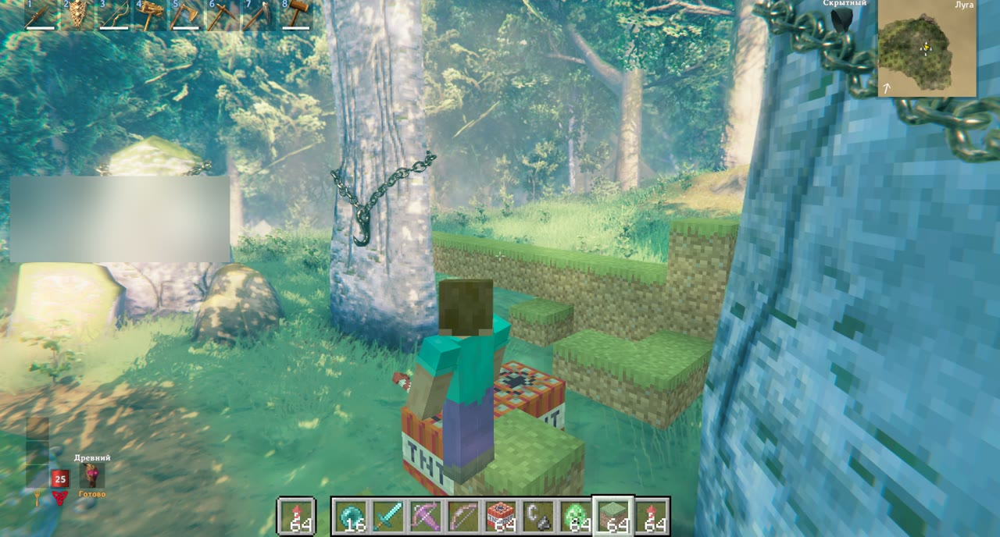
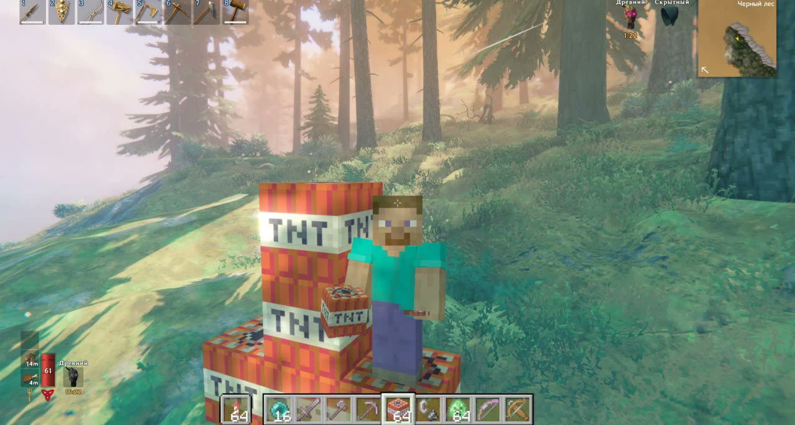
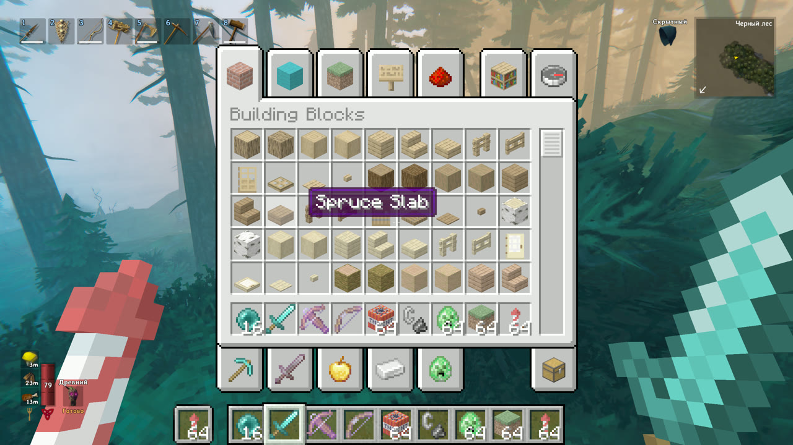

# ValCraft — Minecraft inside Valheim

**[English](#english) · [Русский](#русский)**

Real Minecraft Java runs next to Valheim and is drawn into Valheim's picture: you explore Valheim's world as a
Minecraft player, build and break blocks that Valheim's creatures bump into, and fight trolls with Minecraft swords,
bows, TNT and ender pearls. Inspired by
[Minecraft-Ring](https://github.com/siddoff/Minecraft-Ring) (Elden Ring) and SkyCraft (Skyrim); built on the
Minecraft × GTA V passthrough from [universal-modder](https://github.com/rehan-remade/universal-modder).

> Experimental, single-player (or your own server), Windows only. Built with AI (Claude Code).



| | |
|---|---|
|  |  |
| A TNT tower in the Black Forest | Minecraft's inventory, opened over Valheim |

---

## English

### How it works
- **Minecraft** (a Fabric mod) runs an empty world, hidden. It takes Valheim's camera every frame and hands back its
  picture (colour + depth) through shared memory.
- **Valheim** (a BepInEx plugin + a ReShade add-on):
  - sends the camera and the player, turns Valheim's ground into invisible Minecraft barriers and Minecraft's blocks
    into Valheim colliders (you stand on your builds, creatures stop at your walls);
  - composites Minecraft into the picture before Valheim's UI. Only Valheim's *solid* things hide Minecraft (ground,
    trunks, fallen logs, rocks, buildings, creatures), never grass or leaves;
  - turns Minecraft's swings, arrows, explosions and ender pearls into Valheim damage, chopping, mining, digging,
    craters and teleports.

### Requirements
- Windows 10/11, **Valheim** (Steam) and a **Minecraft Java Edition** account (Microsoft).
- A GPU that runs Valheim on **DirectX 11**.
- Internet for the first install (BepInEx, ReShade, Prism Launcher, Minecraft and Fabric are downloaded from their
  official sources; nothing of theirs is redistributed here).

### Install
1. Download `ValCraft-<version>.zip` from [Releases](../../releases) and unzip it anywhere.
2. Close Valheim, run **`install.bat`**. It:
   - finds Valheim in your Steam libraries (or `install.ps1 -Valheim "X:\...\Valheim"`);
   - installs BepInExPack_Valheim if missing, ReShade (add-on build, as `dxgi.dll`), the ValCraft add-on, effect and plugin;
   - installs a portable **Prism Launcher** in `%USERPROFILE%\ValCraft\prism` with a *ValCraft* instance
     (Minecraft 26.3 + Fabric Loader + Fabric API + the ValCraft mod).
3. Prism opens: **Accounts → Add Microsoft**, sign in, make it the default, close Prism.
4. Steam → Valheim → Properties → **Launch options**: `-force-d3d11` (ReShade needs DirectX 11; if Steam asks
   which version to play, don't pick Vulkan).
5. Play Valheim. Minecraft starts by itself, hidden, on your account (your name and skin), and closes with Valheim.
   The first start takes a minute or two while Prism downloads Minecraft.

To remove: `install.ps1 -Remove` (BepInEx and Prism stay; delete `%USERPROFILE%\ValCraft` for Prism).

### Controls
| Key | Action |
|---|---|
| **R** | Minecraft mode ↔ Valheim mode (Valheim's weapons, hotbar and body) |
| LMB / RMB | Minecraft: attack / break, use / place |
| 1–9, wheel | Minecraft hotbar (in Minecraft mode) |
| **E** | Minecraft inventory (Valheim's "use" when looking at something of Valheim's) |
| **Ctrl** / **Shift** | Minecraft sprint / sneak (hold Shift: no falling off edges) |
| **Space ×2** | fly (creative): Space up, Shift down, Ctrl faster |
| **F5** | first person → behind → in front |
| **F3+F4** | Minecraft game mode switcher (creative / survival / adventure / spectator) |
| F6 / F7 / F8 / F9 | hands toggle / ValCraft on-off / re-level the grid / creative↔survival |

Creative: no damage, endless stamina, flight. Survival: hits land on Minecraft's hearts; dying in Minecraft kills the
Viking. Weapons hit with Minecraft's vanilla damage and attack cooldown (spam-clicking does a fifth), crits when
falling (×1.5, sparks), sword sweeps; pickaxes mine rocks and dig the ground like Valheim's, axes chop trees, tiers
matter.

### Settings
`Valheim\BepInEx\config\valcraft.passthrough.cfg` — keys, `Combat` (damage multiplier, arrows, explosions),
`Render` (`MaxMinecraftPixels`: lower = smoother on big screens, `PoseLag`), `Minecraft` (`AutoStart`, launcher path).

### Troubleshooting
- **No Minecraft at all** — Valheim must run on D3D11 (`-force-d3d11`); check `Valheim\ReShade.log` for
  "Registered add-on ValCraft" and `BepInEx\LogOutput.log` for "connected to Minecraft".
- **Default skin instead of yours** — Mojang's skin server timed out (it's slow from some regions); restart, or use a VPN.
- **Prism asks for an account** — add your Microsoft account in Prism (step 3).
- **Stutter at 1440p/4K** — lower `MaxMinecraftPixels`.

### Build from source
.NET SDK 8, JDK 25, Visual Studio C++ tools.
```
tools\fetch-reshade-headers.ps1
tools\package.ps1 -Valheim "X:\...\Valheim"      # -> dist\ValCraft-<version>.zip
```
Layout: `mc/` Fabric mod · `valheim/plugin/` BepInEx plugin (C#) · `valheim/addon/` ReShade add-on (C++) ·
`valheim/shaders/MCPassthrough.fx` compositor effect · `docs/DEVLOG.md` how it was built and its gotchas.

### Credits
- Passthrough design and the Fabric mod / compositor base: [universal-modder](https://github.com/rehan-remade/universal-modder)
  `examples/minecraft-gta5-passthrough` (MIT).
- Ideas: [Minecraft-Ring](https://github.com/siddoff/Minecraft-Ring), chasm's SkyCraft, TobynJacobs.
- [BepInEx](https://github.com/BepInEx/BepInEx), [ReShade](https://reshade.me) by crosire,
  [Prism Launcher](https://prismlauncher.org), [Fabric](https://fabricmc.net),
  [Java-WebSocket](https://github.com/TooTallNate/Java-WebSocket).
- Written with Claude Code. Minecraft belongs to Mojang/Microsoft, Valheim to Iron Gate/Coffee Stain. Fan project.

---

## Русский

Настоящий Minecraft Java работает рядом с Valheim и вписывается в его картинку: ты ходишь по миру Valheim игроком
Minecraft, строишь и ломаешь блоки (существа Valheim упираются в них), бьёшь троллей мечами, луками, TNT и эндер-жемчугом.

### Установка
1. Скачай `ValCraft-<версия>.zip` из [Releases](../../releases), распакуй куда угодно.
2. Закрой Valheim и запусти **`install.bat`**. Он сам найдёт Valheim в Steam, поставит BepInEx, ReShade, плагин и
   портативный **Prism Launcher** в `%USERPROFILE%\ValCraft\prism` с инстансом *ValCraft* (Minecraft 26.3 + Fabric + мод).
3. Откроется Prism: **Аккаунты → Добавить Microsoft**, войди, сделай аккаунтом по умолчанию, закрой Prism.
4. Steam → Valheim → Свойства → **Параметры запуска**: `-force-d3d11` (Vulkan не выбирать).
5. Запускай Valheim — Minecraft стартует сам, скрыто, под твоим аккаунтом и скином, и закрывается вместе с Valheim.
   Первый запуск — пара минут, Prism докачивает Minecraft.

Удаление: `install.ps1 -Remove`.

### Управление
| Клавиша | Действие |
|---|---|
| **R** | режим Minecraft ↔ режим Valheim (оружие, хотбар и тело викинга) |
| ЛКМ / ПКМ | Minecraft: удар/ломать, использовать/ставить |
| 1–9, колесо | хотбар Minecraft (в режиме Minecraft) |
| **E** | инвентарь Minecraft (или «использовать» Valheim, если смотришь на его объект) |
| **Ctrl** / **Shift** | бег / присед как в Minecraft (с Shift не падаешь с края) |
| **Space ×2** | полёт в творческом: Space вверх, Shift вниз, Ctrl быстрее |
| **F5** | от первого лица → сзади → спереди |
| **F3+F4** | переключатель режимов Minecraft |
| F6 / F7 / F8 / F9 | руки / вкл-выкл ValCraft / выровнять сетку / творческий↔выживание |

Творческий: без урона, бесконечная выносливость, полёт. Выживание: урон идёт в сердечки Minecraft. Оружие бьёт
ванильным уроном Minecraft с перезарядкой (закликивание — 20% урона), криты в падении, размах мечом; кирки копают
камень и землю, топоры рубят деревья, уровень инструмента важен.

Настройки: `Valheim\BepInEx\config\valcraft.passthrough.cfg`. Проблемы — см. раздел *Troubleshooting* выше.

> Экспериментальный фан-проект, только одиночная игра или свой сервер, сделан с помощью ИИ (Claude Code).
